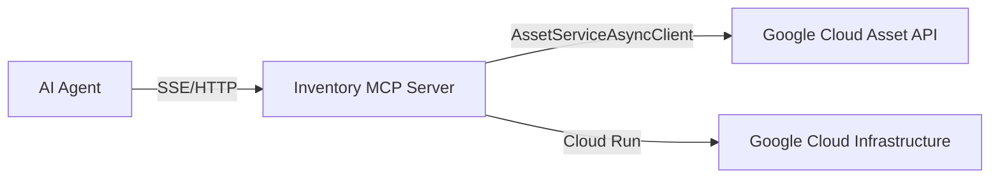

# Google Cloud Inventory MCP

A Model Context Protocol (MCP) server that provides access to Google Cloud Asset Inventory, enabling AI agents to search for and verify the existence of cloud resources.

---

## 🏗️ Architecture



## 🛠️ Tools

### `search_resources`
Search for actual cloud resources to verify outage impact or resource existence.

**Arguments:**
- `scope` (required): The scope of the search (e.g., `projects/my-project`, `organizations/123`).
- `query` (optional): Free text query (e.g., `name:my-instance`).
- `asset_types` (optional): List of asset types to filter (e.g., `["compute.googleapis.com/Instance"]`).
- `location` (optional): Filter by location (e.g., `us-central1`).

---

## 🔐 Authentication

This server enforces **Request-Scoped Authentication**.

*   **Mechanism:** "Pass-Through Identity". The server does not use its own Service Account to access data.
*   **Header:** Clients MUST send `Authorization: Bearer <ACCESS_TOKEN>`.
*   **Token Type:** This must be a **Google OAuth2 Access Token** (NOT an OIDC ID Token).
*   **Scope:** The token must have the `https://www.googleapis.com/auth/cloud-platform` scope.

### 🔌 Client Configuration

To use this with **Claude Desktop**, **Antigravity**, or other MCP clients:

```json
{
  "mcpServers": {
    "gcp-inventory": {
      "url": "https://[YOUR_CLOUD_RUN_URL]/mcp",
      "transport": "sse",
      "headers": {
        "Authorization": "Bearer <YOUR_ACCESS_TOKEN>",
        "Accept": "text/event-stream"
      }
    }
  }
}
```

> **Note**: Modern FastMCP requires `Accept: text/event-stream` for the handshake.

### 🔐 Hybrid Authentication (Fallback)
If your client cannot send headers (or strips them), you can pass the token as an argument:
`search_assets(query="...", token="ya29...")`

### 🗝️ How to Obtain the Token

For local development or testing, generating a short-lived token:

```bash
gcloud auth print-access-token
```
> **Note:** This token expires in 1 hour.

---

## 🚀 Deployment

### Prerequisites
1.  Enable Cloud Asset API:
    ```bash
    gcloud services enable cloudasset.googleapis.com
    ```
2.  Create Service Account:
    ```bash
    gcloud iam service-accounts create inventory-mcp-sa
    ```
3.  **IAM Permissions (Critical):**
    The **End User** (the identity behind the Access Token) needs the following IAM role on the target project(s):
    *   `roles/cloudasset.viewer`

### Deploy to Cloud Run

```bash
gcloud run deploy inventory-mcp \
    --source . \
    --region us-central1 \
    --service-account inventory-mcp-sa@YOUR_PROJECT_ID.iam.gserviceaccount.com \
    --allow-unauthenticated \
    --timeout 60s
```
*(Note: `--allow-unauthenticated` allows the HTTP Handshake, but the Application Logic checks the Bearer Token)*

### Local Development
```bash
# Install dependencies
pip install -r requirements.txt

# Run server
# Note: You need to set valid credentials if running locally
python -m inventory_mcp.server
```
