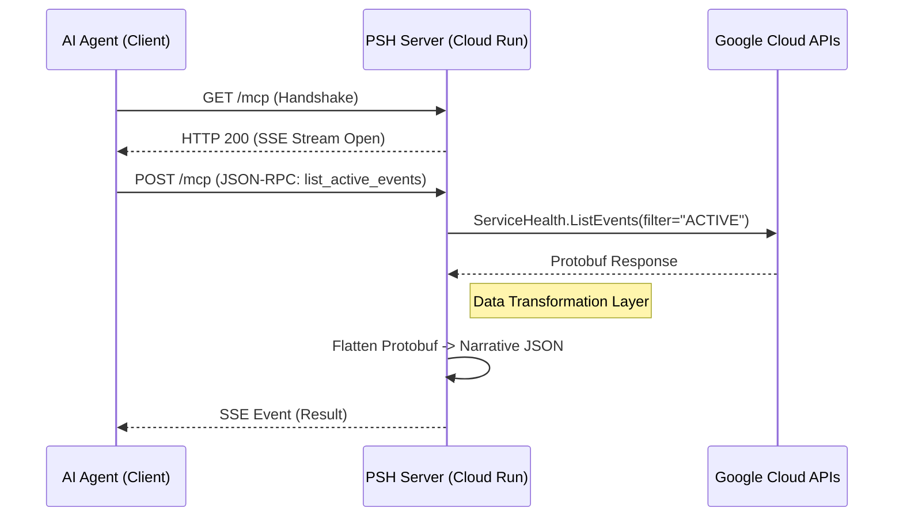

# Google Cloud Personal Service Health - MCP Server

[](LICENSE)
[](pyproject.toml)
[](Dockerfile)

A Model Context Protocol (MCP) server that empowers AI Agents (Claude, Gemini, etc.) to monitor **Google Cloud Service Health** in real-time. 

This server acts as a secure, read-only bridge between your AI assistant and Google's infrastructure, allowing you to ask questions like:
> *"Are there any active outages affecting my 'production-app' project?"*
> *"Which projects in my organization have Service Health monitoring disabled?"*

---

## 🏗️ Architecture

This server is designed for **security** and **scalability**. It uses the **Streamable HTTP** transport pattern over Server-Sent Events (SSE).



## 🛠️ Tools Exposed

| Tool Name | Scope | Description |
| :--- | :--- | :--- |
| `list_active_events` | Project | Lists active incidents and maintenance events. |
| `list_org_events` | Organization | Aggregates health events across the entire Organization. |
| `get_event_details` | Global | Returns a full narrative timeline and workarounds for a specific outage. |
| `list_projects_without_service_health` | Audit | **Audit Tool**: Scans an Org to find projects where the API is disabled. |

---

## 🚀 Deployment

### Option 1: Docker (Local)

1.  **Build the Container**:
    ```bash
    docker build -t psh-monitor .
    ```
2.  **Run (with Default Credentials)**:
    ```bash
    docker run -p 8080:8080 \
      -v ~/.config/gcloud:/root/.config/gcloud \
      psh-monitor
    ```

### Option 2: Google Cloud Run (Recommended)

Deploy as a secure, serverless container.

```bash
# 1. Create a Service Account
gcloud iam service-accounts create mcp-monitor

# 2. Grant Read-Only Permissions
gcloud projects add-iam-policy-binding YOUR_PROJECT \
    --member="serviceAccount:mcp-monitor@YOUR_PROJECT.iam.gserviceaccount.com" \
    --role="roles/servicehealth.viewer"

# 3. Deploy
gcloud run deploy psh-monitor \
    --source . \
    --service-account mcp-monitor@YOUR_PROJECT.iam.gserviceaccount.com \
    --allow-unauthenticated
```

---

## 🔌 Client Configuration

To use this with **Claude Desktop** or other MCP clients:

```json
{
  "mcpServers": {
    "gcp-health": {
      "url": "[https://YOUR-CLOUD-RUN-URL.a.run.app/mcp](https://YOUR-CLOUD-RUN-URL.a.run.app/mcp)",
      "transport": "sse"
    }
  }
}
```

## 🛡️ Security Features

* **Read-Only Design**: This server explicitly includes **no write capabilities**. It cannot modify your infrastructure.
* **Input Validation**: Strict regex validation on Project IDs to prevent injection.
* **Narrative Sanitization**: Removes internal Google metadata fields before sending data to the LLM.

## 🤝 Contributing

We use `pytest` for testing.

```bash
pip install -r requirements.txt
pytest tests/
```
