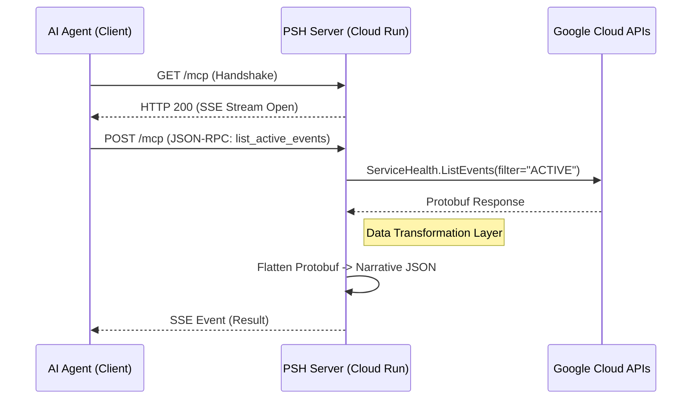

# Google Cloud Personal Service Health - MCP Server

[](LICENSE)
[](pyproject.toml)
[](Dockerfile)

A Model Context Protocol (MCP) server that empowers AI Agents (Claude, Gemini, etc.) to monitor **Google Cloud Service Health** in real-time. 

This server acts as a secure, read-only bridge between your AI assistant and Google's infrastructure, allowing you to ask questions like:
> *"Are there any active outages affecting my 'production-app' project?"*
> *"Which projects in my organization have Service Health monitoring disabled?"*

---

## 🏗️ Architecture

This server is designed for **security** and **scalability**. It uses the **Streamable HTTP** transport pattern over Server-Sent Events (SSE).



## 🛠️ Tools Exposed

| Tool Name | Scope | Description |
| :--- | :--- | :--- |
| `list_active_events` | Project | Lists active incidents and maintenance events. |
| `list_org_events` | Organization | Aggregates health events across the entire Organization. |
| `get_event_details` | Global | Returns a full narrative timeline and workarounds for a specific outage. |
| `list_projects_without_service_health` | Audit | **Audit Tool**: Scans an Org to find projects where the API is disabled. |

---

## 🔐 Authentication

This server enforces **Request-Scoped Authentication**.

*   **Mechanism:** "Pass-Through Identity". The server does not use its own Service Account to access data.
*   **Header:** Clients MUST send `Authorization: Bearer <ACCESS_TOKEN>`.
*   **Token Type:** This must be a **Google OAuth2 Access Token** (NOT an OIDC ID Token).
*   **Scope:** The token must have the `https://www.googleapis.com/auth/cloud-platform` scope.

### 🔌 Client Configuration

To use this with **Claude Desktop**, **Antigravity**, or other MCP clients:

```json
{
  "mcpServers": {
    "gcp-service-health": {
      "url": "https://[YOUR_CLOUD_RUN_URL]/mcp",
      "transport": "sse",
      "headers": {
        "Authorization": "Bearer <YOUR_ACCESS_TOKEN>",
        "Accept": "text/event-stream"
      }
    }
  }
}
```

> **Note**: Modern FastMCP requires `Accept: text/event-stream` for the handshake.

### 🔐 Hybrid Authentication (Fallback)
If your client cannot send headers (or strips them), you can pass the token as an argument:
`list_active_events(project_id="...", token="ya29...")`

### 🗝️ How to Obtain the Token

For local development or testing, generating a short-lived token:

```bash
gcloud auth print-access-token
```
> **Note:** This token expires in 1 hour.

---

## 🚀 Deployment

### Option 1: Docker (Local)

1.  **Build the Container**:
    ```bash
    docker build -t psh-monitor .
    ```
2.  **Run**:
    ```bash
    docker run -p 8080:8080 psh-monitor
    ```

### Option 2: Google Cloud Run (Recommended)

Deploy as a secure, serverless container.

**IAM Permissions (Critical):**
The **End User** (the identity behind the Access Token) needs the following IAM role on the target project(s):
*   `roles/servicehealth.viewer`

The **Cloud Run Service Account** only needs permission to write logs (and basic run permissions).

```bash
# 1. Deploy
gcloud run deploy psh-monitor \
    --source . \
    --start-command="python psh_mcp/server.py" \
    --allow-unauthenticated
```
*(Note: `--allow-unauthenticated` allows the HTTP Handshake, but the Application Logic checks the Bearer Token)*

---

## 🛡️ Security Features

*   **Read-Only Design**: This server explicitly includes **no write capabilities**. It cannot modify your infrastructure.
*   **Input Validation**: Strict regex validation on Project IDs to prevent injection.
*   **Narrative Sanitization**: Removes internal Google metadata fields before sending data to the LLM.

## 🤝 Contributing

We use `pytest` for testing.

```bash
pip install -r requirements.txt
pytest tests/
```
